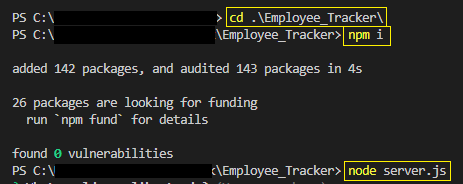
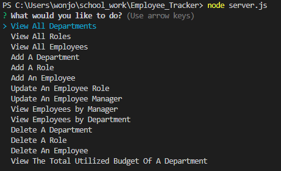

# Employee Tracker

## Description

Discription : 
This application allows a user to view and manage the departments, roles, and employees in the user's company
- Use node.js to implement this application
- Use 'mysql2' to connect to MySQL database and perform queries 
- Use 'inquirer' to interact with the user via the command line
- Use 'dotevn' to hide private information from public place
- Use 'console.table' to print MySQL rows to the console

## Table of Contents
1. [Installation](#installation)
2. [Usage](#usage)
3. [License](#license)
4. [Contributing](#contributing)
5. [Test](#test)
6. [Questions](#questions)

## Installation

1. Move to the directory where server.js is
2. npm i
3. node server.js

Please refer to the image below.

## Usage

1. When a user starts the application, the following options are shown: view all departments, view all roles, view all employees, add a department, add a role, add an employee, update an employee role, update an employee manager, view employees by manager, view employees by department, delete a department, delete a role, delete an employee,  and view the total utilized budget of a department

2. When a user chooses to view all departments, a user is presented with a formatted table showing department names and department ids

3. When a user chooses to view all roles, a user is presented with the job title, role id, the department that role belongs to, and the salary for that role

4. When a user chooses to view all employees, a user is presented with a formatted table showing employee data, including employee ids, first names, last names, job titles, departments, salaries, and managers that the employees report to

5. When a user chooses to add a department, a user is prompted to enter the name of the department and that department is added to the database

6. When a user chooses to add a role, a user is prompted to enter the name, salary, and department for the role and that role is added to the database

7. When a user chooses to add an employee, a user is prompted to enter the employee’s first name, last name, role, and manager, and that employee is added to the database

8. When a user chooses to update an employee role, a user is prompted to select an employee to update and their new role, and this information is updated in the database

9. When a user chooses to update an employee manager, is prompted to select an employee to update and their new manager, and this information is updated in the database

10. When a user chooses to view employees by manager/department, a user is presented with the manager's name and employees who report to that manager

11. When a user chooses to delete a department/ a role / an employee, a user is prompted to select an item to delete and this item is deleted from the database

12. When a user chooses to view the total utilized budget of a department, a user is presented with the total salaries of employees who belong to each department

`Please refer to the walkthrough video`

## License

Copyright (c) 2022 `wonjong2` (GitHub Username) Licensed under [the MIT License](https://choosealicense.com/licenses/mit/).

## Contributing

All your inputs are valuable and I love them.

- Reporting a bug
- Submiiting a fix
- Proposing new features

## Test

N/A

## Questions

1. GitHub: https://github.com/wonjong2
2. If you have any questions, please reach out to wonjong2@gmail.com
